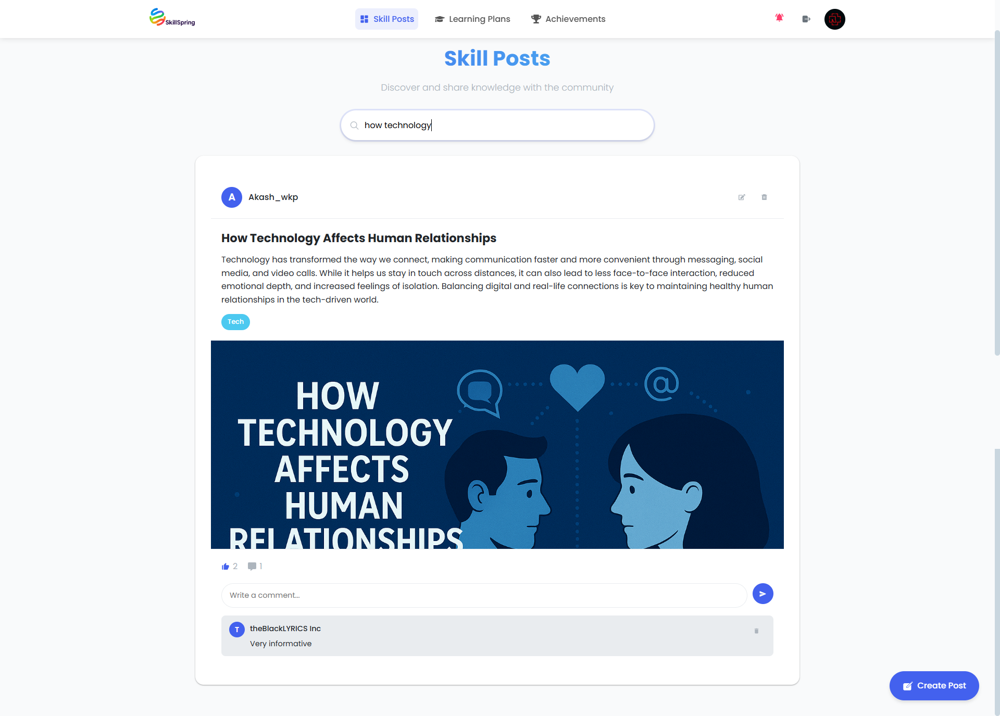
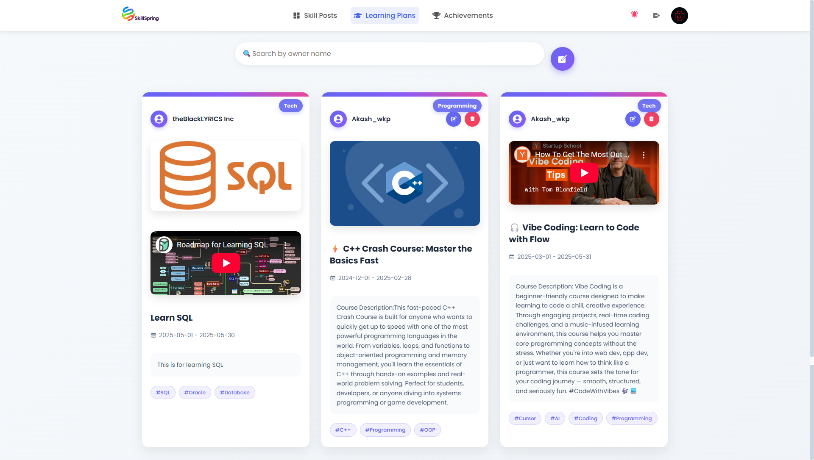
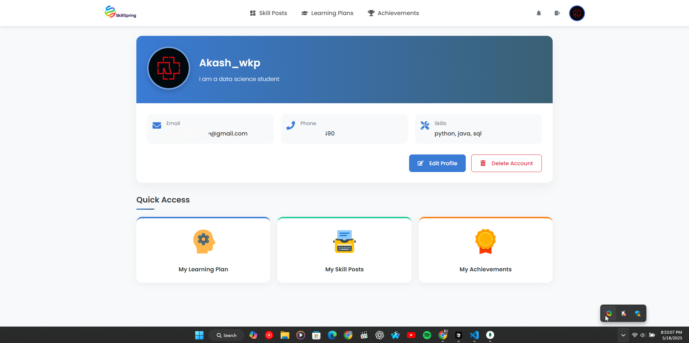
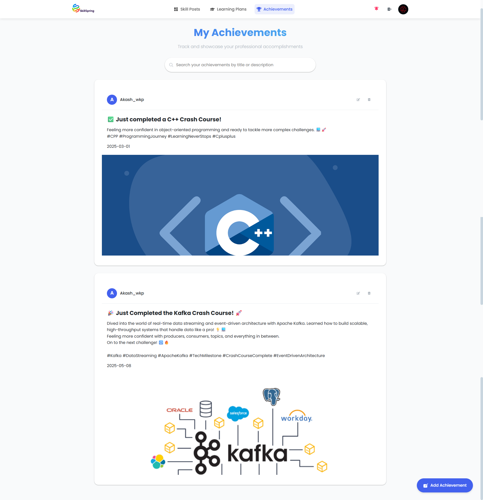

# SKILLSPRING---A-Skill-Sharing-and-Learning-Platform

A modern full-stack web application built with React and Spring Boot, designed to help users enhance their skills and track their learning progress.

## 🚀 Features

- Modern, responsive user interface built with React
- Secure authentication and authorization using Spring Security
- RESTful API architecture
- MongoDB database integration
- Email notification system
- OAuth2 client integration for social login
- File upload capabilities

## 📸 Screenshots

### Home Page


### Learning Plans Page


### Profile Page


### Achievements


## 🛠️ Tech Stack

### Frontend
- React 19
- React Router DOM
- Axios for API communication
- Framer Motion for animations
- React Icons
- FontAwesome
- React Modal

### Backend
- Spring Boot 3.4.4
- Spring Security
- Spring Data MongoDB
- MongoDB Database
- Spring Mail
- OAuth2 Client

## 📋 Prerequisites

- Node.js (Latest LTS version)
- Java 21
- Maven
- MongoDB

## 🚀 Getting Started

### Frontend Setup
```bash
cd frontend
npm install
npm start
```

### Backend Setup
```bash
cd backend
mvn spring-boot: run
```

## 🔧 Configuration

1. Configure your database connections in `backend/src/main/resources/application.properties`
2. Set up your OAuth2 credentials
3. Configure email settings for notifications

## 📝 License

This project is licensed under the MIT License - see the LICENSE file for details.

## 👥 Contributing

Contributions are welcome! Please feel free to submit a Pull Request.

## 👨‍💻 Contributors

<a href="https://github.com/Akash-Karunanayake/SKILLSPRING---A-Skill-Sharing-and-Learning-Platform/graphs/contributors">
  
</a>


## 📧 Contact

For any queries or support, please open an issue in the repository. 
